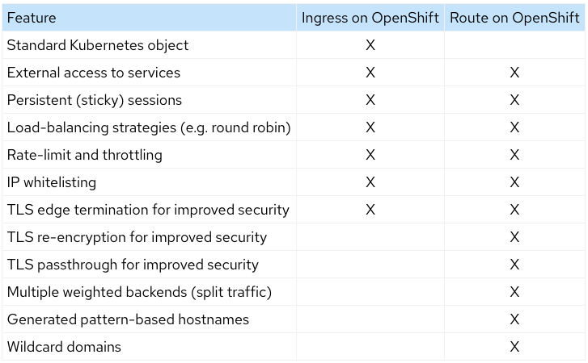

+++
title = "Networking"
weight = 1
description = '''
OpenShift Networking
'''
categories = ["Engineering"]
tags = ["OpenShift", "Networking", "Ingress"]
+++

## Routes vs Ingress

As mentioned above, Routes were the initial implementation for external access of services for OpenShift, before Ingress was developed out of it for Kubernetes. OpenShift now utilizes both, a controller to keep the 2 in parity between OCP and K8s-targeted deployments

### References

* [Kubernetes Ingress vs OpenShift Route](https://cloud.redhat.com/blog/kubernetes-ingress-vs-openshift-route) - Older blog on the history of the 2 solutions.
* [A Guide to using Routes, Ingress and Gateway APIs in Kubernetes without vendor lock-in](https://cloud.redhat.com/blog/a-guide-to-using-routes-ingress-and-gateway-apis-in-kubernetes-without-vendor-lock-in)
* [K8s Ingress vs. OpenShift Route - DEV Community](https://dev.to/langyizhao/k8s-ingress-vs-openshift-route-cmc)
